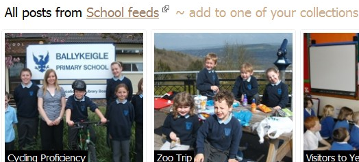

**Spective** provides a visual way of sifting through school blogs by showing the image and using the image as context.

URL: http://www.spectives.com/primary

**RSSVoyage** displays only text on your page but allows you to easily move through blogs and time.  RssVoyage requies you paste the RSS feed address in (bottom left).   RSSVoyage has been pretty buggy for me, let me know what your experience is like!

URL: http://rssvoyage.com

Feed URL: http://www.xfruits.com/johnyma22/?id=80412

Both require registration, both are free.
