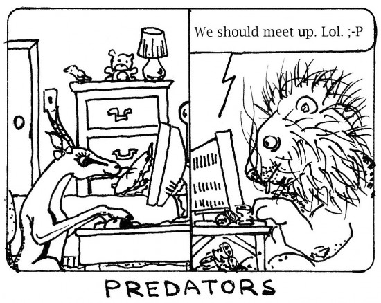

CEOP seems to of had a big knock this month and I'm not sure anyone other than RBC's are being vocal about protecting children online?  Certainly most of the development we have done has been ignored by most educators.   Schools are required to get 3 quotes for purchases over X amount so why not consider performing a risk assessment when purchasing hosted web services?   I guess there needs to be a carrot.  Maybe [Naace](http://www.naace.co.uk) could set up a quality assurance mark for hosted web services?  Just an idea...
