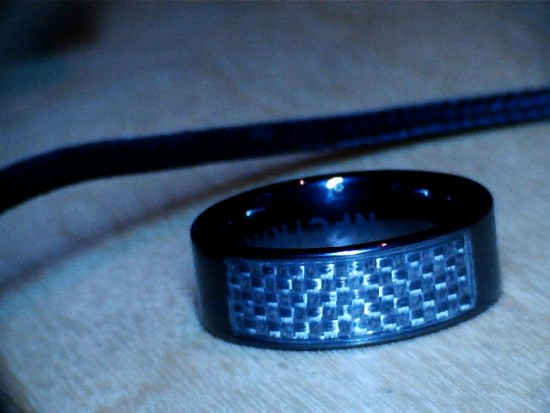
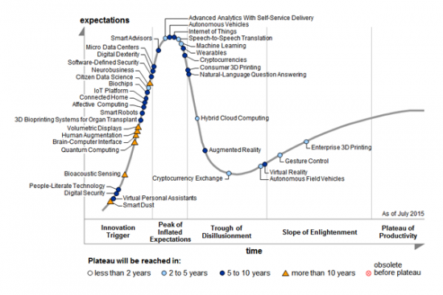

2+ years of my life is available for you to back (or not). [Check it out on Kickstarter](http://nfcring.com/2016)..

During this time I got married, ate a lot of curry, um, no other benchmarks really..

On a personal note.. If we raise anything < £200k I still wont see a penny, crazy huh? Don't launch new products, they drain your soul and capital. My entire drain into this product now is about ~£144k.. That's a lot of cash... I have plans to turn it around though! :)

The main reason of doing Kickstarter is to validate market demand. If people want it, we will make it and that proves to myself and investors it's a worthwhile venture. The more we make, the more that gets invested, and the cycle of madness continues...

I'd like it if we could raise more than our initial launch but I doubt that because of the gartner hype cycle.. I'd say we're nearer to the trough than the peak mostly because V2s are never as exciting as V1s.. We're definitely nearing the Slope as we're seeing innovations land elsewhere around our tech that really do improve peoples lives..

Stay frosty people and thanks for backing :)
