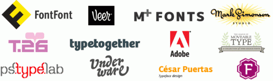

So you want to change the font on your website and you want it to be a funkier font? Google appears to lower their competitors in Google search results so I figured I would give them a fighting chance.

[PrimaryBlogger](http://primaryblogger.co.uk) has the Google Font API plugin enabled by default.  You can install the plugin from the "Add New" tab under the plugins section of your WordPress admin. Or, upload the plugin folder to your server and do it the old fashioned way.

Here are 3 font APIs you could use:

## 

## [TypeKit](http://typekit.com/tour/library)

Free for 2 fonts, slightly fussy to deploy, requires sign up, requires a badge on your website.

* * *

## 

## [Fonts.Com Developer Font API](http://webfonts.fonts.com/)

Thousands of fonts, slightly fussy to deploy, requires sign up, requires a badge on your website.

* * *

## [Google Fonts API](http://code.google.com/apis/webfonts/)

Google Font API is probably the easiest of the 3 to deploy and doesn't require a badge or sign up. It is the most limited as far as # of fonts to chose from.

* * *

##  [Awesome Font stack](http://awesome-fontstacks.com/)

A super slick font selector/generator that gives you the files and CSS to go ahead and get started. I like it because you can try multiple fonts together before downloading them.

[Find our more about webfonts](http://www.webfonts.info/)

###### Related articles

- [Introducing the Ubuntu Font Family to the web](http://googlewebfonts.blogspot.com/2010/12/introducing-ubuntu-font-family-to-web.html) (googlewebfonts.blogspot.com)
- [Google now offering worldwide usage stats for its Fonts API \[TNW Google\]](http://thenextweb.com/google/2010/11/25/google-now-offering-worldwide-usage-stats-for-its-fonts-api/) (thenextweb.com)
- Ubuntu Font added to Google Font Directory (omgubuntu.co.uk)
- [Google Font Previewer](http://googlesystem.blogspot.com/2010/07/google-font-previewer.html) (googlesystem.blogspot.com)
- [22 Best free fonts for Designers](http://www.shoutmeloud.com/22-best-free-fonts-for-designers.html) (shoutmeloud.com)

