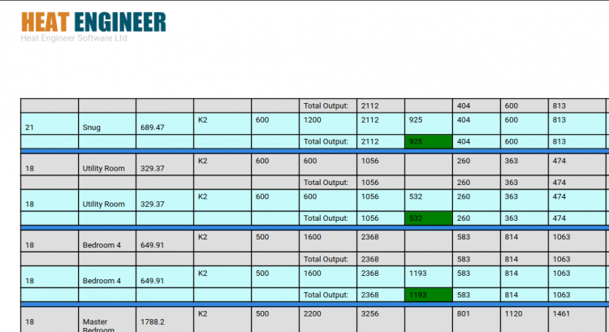
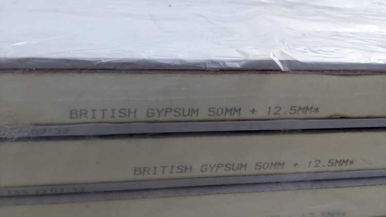
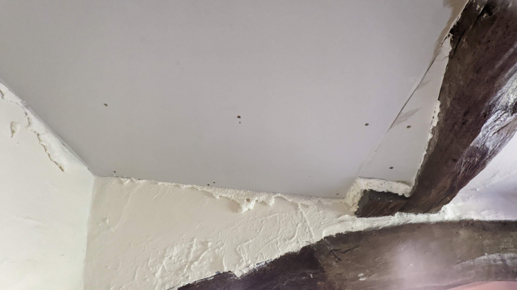
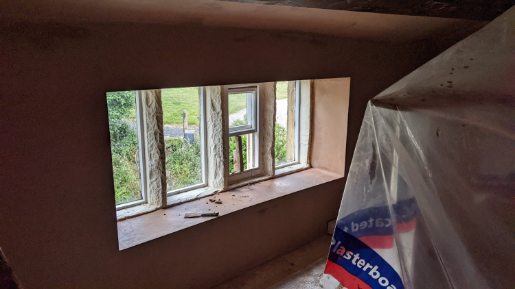
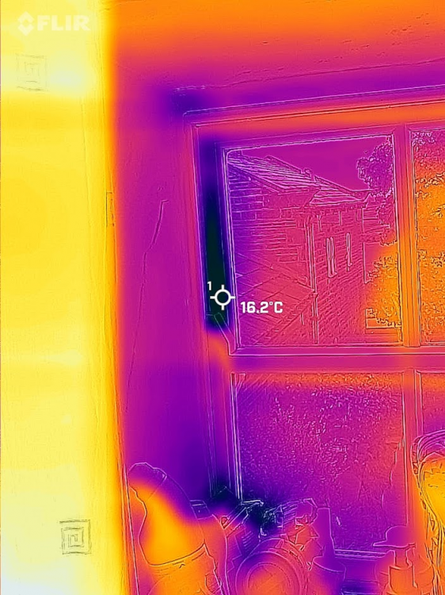
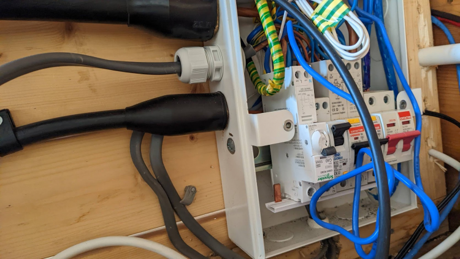
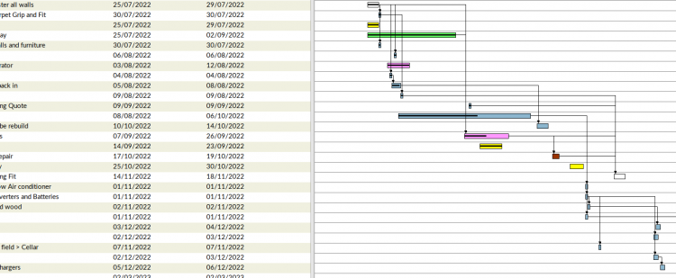
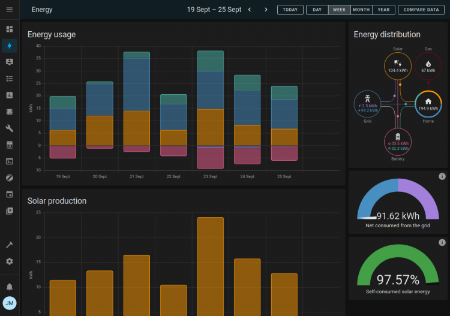

TLDR;

- Stopping losing heat is much easier than generating heat.
- Thermal imaging is better than leak testing.
- The power infrastructure in the UK is not ready.
- Sourcing the correct RCBO for an inverter can be tricky and Lead times for Renewable items can be long.

In 2020 I began a project to modernize a 5 bedroom grade 2 listed property. I share my timelines, learning and price points. It's likely these price points can be reduced significantly but I tried to state them as if all work was completed by a contractor, in reality the costs were significantly less because I did most of the work myself.

## Keeping in the heat

Grade 2 listed buildings are notoriously difficult to keep warm. Often with no insulation, poor glazing and leaky stone work. Grade 2 means you are restricted in what you can do, however most of the learning I am sharing in this post should apply to non and other listed types of properties. My heat loss was 33Kw which is bad. To get this value I used heat-engineer software/app which was painful but at least accurate. Most free online tools can't handle vaulted ceilings and weird edge case materials. I think I spent maybe £20 on the app and while the app is pretty tricky to use I got enough information for both me and the heat pump manufacturer I am working with.

<figure>

<figcaption>

heat-engineer.com is pretty janky to use but it gives useful data out and is quite thorough.

</figcaption>

</figure>

**If you are considering a heat pump one free test to do is set your central heating to have a flow temp of ~55 degrees, this will help identify rooms that might have undersized radiators as you will notice they are cooler than expected.**

Before insulating we addressed the poor pointing and areas where water could get through the roof/walls and into the property. Re-pointing and some roofing fixes came in at about £15k and took a noisy and messy month or so.

My first step on insulating the properties began at the doors, while doors aren't a huge factor I knew for a fact mine were drafty so new solid-wood like-for-like doors went on at the cost of about £2k.

Next I shifted my attention to insulation and settled on a 2 phased quote to insulate the whole property at the cost of about £30k.

<figure>

<figcaption>

The insulation we opted for after checking U Values.

</figcaption>

</figure>

I had a team of 5 in for about 2 weeks and I am glad I didn't take this job on myself. To prepare for the insulation means an entire house strip down so not a convenient thing. Post Insulation required re-fitting & cleaning carpets, skirting boards, all fixtures and fittings and redecorating the whole property so it was important to do this early and before secondary glazing. Redecoration came to about £10k. Lead time for most of this work was about 2 months.

<figure>

<figcaption>

Insulation board up and expanding foam around edges.

</figcaption>

</figure>

A quick side note on internal wall insulation. If you have radiators on external walls you are going to be moving them and this means getting plumbers in. While they are in, if you are considering a heat pump (air or ground) it might be worth considering upgrading your radiators, copper pipework from 15mm to 22mm and run the (26mm?) pipework for the heat pump to connect into the central heating system/hot water. It is MUCH cheaper, cleaner and efficient to do this at this point and not post insulation work. The same may apply for electrics. In total I spent about £2k on changes to the central heating system and replacing radiators with oversized ones ready for a heat pump.

<figure>

<figcaption>

Jakoboard on sill then smooth plastered

</figcaption>

</figure>

The insulation contractor had a friend who had a leak/chamber/air change test machine he charged out at £250 a visit, he did the first visit and because the house was so leaky the unit couldn't work and as such from my personal experience unless you are testing a leak proof house then this approach is a waste of time. To test the performance of the insulation my friend Ash came up with his FLIR camera and we reviewed the whole house. I was staggered by how effective the FLIR was for this use case and it helped identify 3 cold areas I didn't expect to see and rule out an area I was sure had a draft.

<figure>

<figcaption>

FLIR camera caught the cold spots incredibly well, I was impressed.

</figcaption>

</figure>

While the house was messy I took the opportunity to properly deaden off existing fireplaces by removing any material left in the fire place and by installing a galvanized steel sheet and properly sealing the chimney stack at the bottom. The top of the chimney was left able to breath without allowing too much moisture in. I spent about £1k on chimneys at the time including some minor stove repairs, sweeps etc.

Secondary glazing must come after insulation and in total came to about £6k as only half the property needed doing. Lead time for most of this work was about 2 months.

I also took this time to ask Alan from Ash Carpentry to do a review of the state of the sash windows and replace any rotten wood. It was ideal to do this now because we were still decorating so we didn't have to revisit decoration twice.

So to summarize; I added internal roof/wall insulation(technically room in room), secondary glazing, updated doors, oversized radiators and central heat piping. **All these things combined changed the house **heat requirement** from ~33Kw to ~15Kw. Noice.**

## Power Infrastructure

I naively made the assumption that because the property was < 1km away from a substation and I live on an A road that I would have suitable cabling running to the house. And in some ways, I do. I have a 100Amp Fuse and at 240 Volts that's 24Kw available at surge, way less then I have ever needed and less than a heat pump should need, but here's the kicker, while I technically can pull that amount of current the infrastructure provider (DNO/Northern Grid) simply can't support it and require that I provide supplemental paperwork to pull this amount of current from the grid. Sadly, for me, and probably the case for you is that they will require you move onto the three phase system at a cost of ~£25k, something I had not budgeted for. Personally I decided not to pursue this approach and instead I doubled the budget to £50k and I will bring up my own substation and additional energy generation.

## Solar/PV and the Inverter

My Solar / PV system is super simple and it was very easy to get setup but I had a weird edge case bug. My RCBO tripped when it rained... I was able to replicate the bug by sprinkling water onto the panels. After significant reading I discovered that the DC to AC isn't entirely separated so noise from the DC system can end up on the AC export and because of this the Huawei datasheet recommended an **RCBO that had a 100mA sensitivity**, the one I was using was 30mA and 30mA is the norm for nearly everything in a consumer setting. The lead time on the 100mA RCBO was quite long and it was quite expensive but all in all I think £60 or so and a month or so later I was backup running reliably when it rained. I think all in all my solar, battery storage and smart home connectivity came to about £8k.

<figure>

<figcaption>

Err, whoops, a Schneider was a temporary 100mA fix...

</figcaption>

</figure>

At the time of writing this, lead times for renewable related projects are a minimum of 3 months. Edge case items such as Huawei's Smart Power Sensor are 6 months. I made a mistake of thinking I could use an item from AliExpress but sadly this didn't work. I should have ordered the smart power sensor when I ordered the other items as it was in stock at the time. I tried to save myself ~£100 and I wasted probably £5 a day in exporting energy back to the grid I wasn't paid for.

Officially you can only put 3.6Kw back onto the grid without permission, I put back max 1Kw as I have localized dumps (dehumidifiers, hot tub, pod pumps) etc. I can dump into. Putting back into the grid is a fools errand too unless you get on a good pay-in deal which at the time of writing are non-existent.

## The glue

I use Home Assistant as my glue and Gantt project as my management software. I'd recommend looking into both if you want to do a similar project.

<figure>

<figcaption>

Gantt Project

</figcaption>

</figure>

<figure>

<figcaption>

Home Assistant, Bright Integration (for gas), Huawei Solar HACS Integration (for whole house usage, solar and storage), Emporia Vue Integration (for single circuit consumption).

</figcaption>

</figure>

## In summary

~£70k for reducing the heat output from ~33kw to ~15kw.

~£10k in Solar reducing my electricity bills by about £120 a month.

It's too early to project Gas cost savings but these changes will significantly reduce my reliable on fossil fuels so for me that's a win. Long term I want to be energy independent.

These types of projects can be called Retrofit or renovation or some other fancy term, ultimately my goal is to reduce my carbon footprint and hopefully keep this house sustainable for another 100 years or so, if you are going on a similar journey and I helped please comment, _like_ and subscribe.
