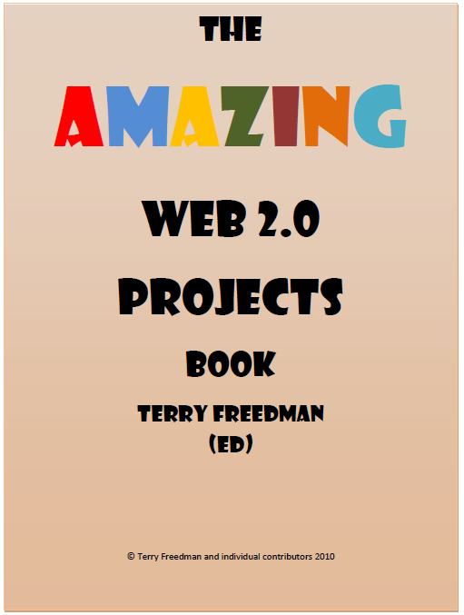

 Be your role technical or leadership it is always important to be influenced and to share ideas.  One man, and only one man has made this possible by gathering [examples of projects run by schools and compiling them into an easy to read Book](http://www.ictineducation.org/free-stuff/).

I recommend those working in Primary Education read pages 14-48 closely and try hard not to be inspired by the work other schools are doing in this area.

[Here is a link to the book](http://www.ictineducation.org/free-stuff/) and here is a link to [the Author - Terry Freedman](http://www.ictineducation.org/)
