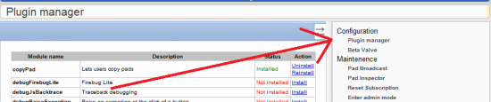

To access your Etherpad plugin manager visit **http://yourdomain.com/ep/admin <-- you may need to alter port ie :9000**

When prompted type your password then click Configuration -> Plugin Manager

The default password is password
