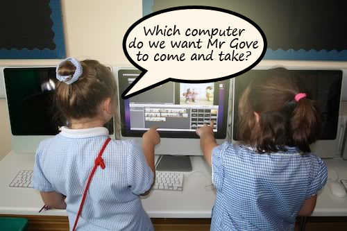

It is never popular talking about how schools can save money on ICT or areas where spending is just too high.  Sorry if you fall out with me on this one..  These are all suggestions, I don't endorse any in any way, shape or form (this is mostly for political reasons...).

For the most part you get what you pay for, so any savings may mean a drop in quality and a negative impact on teaching and learning.  The [conservative education policy](https://mclear.co.uk/2010/02/28/the-conservative-education-policy-is-lead-by-the-wrong-person/) is (we assume) run by people with more knowledge than myself so when they say schools need to spend less on ICT all I do is figure out how..

**It is up to you to decide how they will impact your teaching and learning.**

****

## 1\. Printing

### Potential savings in average 2 form entry school: £500

Yep, the ugly ink spewing beast is still costing even the smallest of primary school thousands of pounds every year mostly in toners and ink.  So how can a school save money?

a) Use a managed printing solution to reduce the cost per sheet and to restrict the amount certain users can print.

b) Use on-line collaboration such as [email](http://schoolemail.co.uk) more effectively

c) Encourage parents to get on-line and use an e-newsletter / social networking

## 2\. MIS support

### Potential savings in average 2 form entry school: £2000

Why is it that one application costs nearly as much to support as the entire network full of applications used on the curriculum side?

a) Change your support provider to a [more cost effective option](http://primaryt.co.uk/sims-cmis-network-support.html)

b) Use e-registration and remove the need to replace that nasty OMR

## 3\. Internet connectivity

### Potential savings in average 2 form entry school: £2000

Internet provision from Becta approved providers usually costs 2 to 4 times that from a local internet provider, this is because they usually bundle educational services into the package and/or tools to collaborative with other schools in your area.

a) Change to a [local internet provider](http://primaryt.co.uk/education-filtered-internet-service.html) offering less bandwidth at reduced rates

## 4\. Backups

### Potential savings in average 2 form entry school: £250

Tape backups are horribly inefficient, unreliable and costly.

a) Use [remote backup services](http://schoolbackups.co.uk)

## 5\. AV

### Potential savings in average 2 form entry school: £500

Most schools have now spent up on purchasing interactive classroom stuff, replacement bulbs can cost up to £500 each

a) Maintain your projects by [pro actively cleaning filters and performing regular maintenance](http://primaryt.co.uk/ict-projector-whiteboard-installation.html)

## 6\. Software Licensing

### Potential savings in average 2 form entry school: £500

Microsoft have now released their Office web apps so when you come to purchase new devices you can almost ignore the cost of Microsoft Office licensing.

a) Get familiar with [Live @ Edu](http://liveatedu.com) & [Office Web Apps](https://mclear.co.uk/2010/06/11/microsoft-office-web-apps-2010-in-the-primary-classroom/) or [Google Web Apps](http://google.com/apps)

b) Become familiar with the vast array of [free web 2 tools](http://primaryschoolict.com/web2.php) for schools

## 7\. Technical support

### Potential savings in average 2 form entry school: £500

From personal experience I know a major cost of technical support is the time spent visiting a specific machine.  There are obvious advantages to having an on-site engineer.  Face to face support is still by far the best we have right now but that is because we haven't really explored the realm of good remote desktop support for our curriculum networks as of yet.

a) Encourage your [technical support provider](http://primaryt.co.uk) to explore on-demand live remote desktop support and monitoring

###### Related articles by Zemanta

- ['Dark age' fears](http://news.bbc.co.uk/go/rss/-/1/hi/education/10495726.stm) (news.bbc.co.uk)
- [Curtains for Becta](https://mclear.co.uk/2010/05/24/curtains-for-becta/) (mclear.co.uk)

