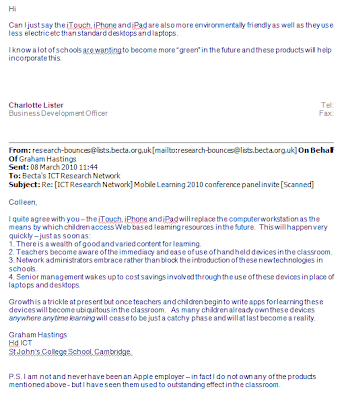

  

Such a knowledge #fail Posted on Becta Public ICT Forum

  

Want to go ethical and buy an ipad?  Here is [1 reason not to](http://www.telegraph.co.uk/technology/apple/7330986/Apple-admits-using-child-labour-in-China.html) published just this week.

The thought of teachers writing apps for the ipad cracks me up...  
  
My response read:  

> Graham are you aware that to develop an app for an ipad/phone/touch you need an apple laptop/workstation?  How are pupils/teachers going to start making apps if in you have replaced their computer?

> I disagree entirely that these devices will replace workstations/netbooks/notebooks/laptops (whatever) – they will complement your existing technology.

> Finally, in my opinion apple won’t win out in the tablet market, why would they when you could buy a HP tablet and already have a wealth of learning tools available or even an open source device that is android powered and have a mass market of free excellent tools?

> RE the environmental issue, in the words of our favourite mayor, what a “load of codswobble”
