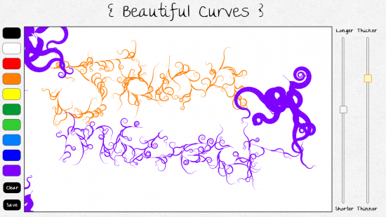

[Beautiful Curves](http://tholman.com/experiments/html5/beautiful-curves/) is a really nice web based tool for creating pretty drawings.

No doubt you will do what I did and either write your name or draw a face!

It wins in the coolness category too as it's built using canvas/JS so it's open source and free to play :)

Nice!
