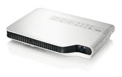

  

  

  
Bett is over for another year, do you feel these are the top 5 finds?

  

**5\. Development Games package -** This interesting use of technology is nothing new but it's fun and easy to adopt, [Timocco's](http://timocco.com/) new software (although it's not web2) is a way of interacting with PC applications by using your hands.

4\. LED projector - Casio - doesn't require a bulb

Ever had the shock of the cost of a replacement bulb for your classroom projector? Most suppliers now supply a 3 year bulb warranty however the LED infused Casio replaces a standard bulb with powerful LED's, capable of 3000 lumens and a reasonable throw (compared to it's competitors). Shame about the price tag, £900+! Tied a close 4th was the Smart Document Camera.

  

**3\. IWB projector that doesn't require an IWB** _(Epson BrightLink 450Wi interactive projector)_

Epson showed off their latest short throw projector that doesn't require an IWB (Interactive White Board) for it to have Interactivity. Most schools will probably want a whiteboard anyway but this product decreases cost of ownership by removing the interactivity from the board, we expect that our price on these will be £1600 fully fitted.

  

**2\. 3D LCD screen that doesn't require glasses**

This is one of those items I have been waiting about 6 months to see in the flesh and I hate to say it that I wasn't bowled over but I was excited! The demo I saw didn't have any decent content on it, I would love to borrow one for a few weeks and watch a load of 3d movies on it to evaluate the difference and to document some practice teaching and learning uses.

  

**And in at 1\. Finding out my cousin's son frequently learns and plays on [Primary Games Arena](http://primarygamesarena.com/).** _Awesome!_

__

[Win!](http://primarygamesarena.com/)

  

  

As always, because I'm a moody monkey I had a beef with a few things:

  

The lack of creativity and research/thought that went into naming edupics.org baffles me, a bad name for a service when there is already a great service called [edupics.com](http://edupics.com/) doing something similar and for free...... Bee-It disclosed their genius business model.... Charge suppliers for web space. Fail... Google's advertising. . Google, if you are listening. You don't need to advertise, we are already at your mercy. Stop wasting resources.

  

**And some notes/thanks:**

  

Had some great chats with @simfin, @merlinjohn, @ianaddison and many more great people, thanks! There were lots of interactive flash content creators there again this year, I expected that this market would of pushed quite a few out but obviously some are going strong! Sorry I didn't do any evening events this year, I decided on my only evening available to go and see my family which I'm glad I did because we all had a great time :).. I discovered the [NEN](http://www.nen.gov.uk/) website has some great resources to offer, you should [check them out](http://www.nen.gov.uk/tandl).. Oh and [It's learning](http://www.itslearning.co.uk/) is probably my favourite VLE provider as it is inclusive for service providers, unlike pretty much every other VLE...

  

**What I want to see in 2011? And I think I will...**

  

A short throw LED projector that has interactivity built in.

  

**Other peoples thoughts about Bett2010**

[Xannov's](http://bit.ly/67ezNu)

[Jan Webb's](http://janwebb21.primaryblogger.co.uk/2010/01/16/a-big-bett2010-day-out)
