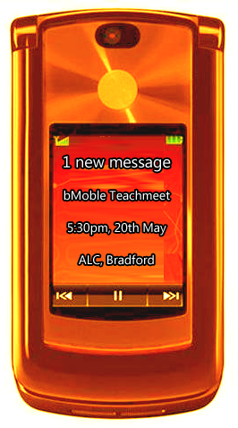

 The [bMoble](http://www.mymobilelearning.com/) [Teachmeet](http://www.teachmeet.org.uk/) will be at 5:30pm on the 20th of May at the [Abundant Life Centre](http://maps.google.co.uk/maps?um=1&ie=UTF-8&cid=0,0,14693405446638824201&fb=1&hq=Abundant+Life+Centre&hnear=England,+Pudsey&gl=uk&daddr=Abundant+Life+Centre,+Wapping+Road,+Bradford,+West+Yorkshire+BD3+0EQ&geocode=11804906193312286155,53.798738,-1.745465&ei=Z53VS5CnAony0gTw1pnVDQ&sa=X&oi=local_result&ct=directions-to&resnum=1&ved=0CAkQngIwAA)

Curry will be provided by the [Mumtaz curry house](http://www.mumtaz.co.uk/).

The bMoble conference will end at 3:30pm at which point some refreshments will be available in the form of a [nearby pub](http://maps.google.co.uk/maps/place?hl=en&um=1&ie=UTF-8&q=the+bridge+pub+bradford&fb=1&gl=uk&hq=the+bridge+pub&hnear=bradford&cid=15826957347391933610).

[More details on the conference available here.](http://www.bradfordschools.net/bmoble/index.php?option=com_content&view=article&id=9&Itemid=13)
