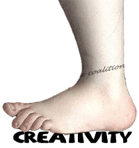

 The new Primary Curriculum is axed. Cutting the creative curriculum means 1 of 2 things, either: **a) schools can adopt their own creative curriculum without government guidance** or **b) schools have to stick to the current curriculum**

Option a seems to make _most sense_ as Cameron talks about empowering teachers.

So it is very likely schools will have to stick the current curriculum (option a) as sensible decisions isn't the way Whitehall operates.  Anyone else get the "If it can be cut - cut it" type mentality?  On the same day as Cameron reminded us that our national debt is larger than Ron Jeremy's libido.

It is no surprise that any "new spending" or "new project" would get cut but it seems like the Conservatives need to be clear and frank about the Primary Curriculum and their reasons for not proceeding with it after teachers have collectively spent tens of thousands of hours working towards delivering it.

Before Becta closes they have rushed through the [Self review framework](http://en.wikipedia.org/wiki/Self-review_framework "Self-review framework") changes.

What do you think?  Do you think it will be option a or b?  Leave a comment and let me know your thoughts.

> **UPDATE**:  In the meantime, the Department has advised schools that the existing primary curriculum will continue to be in force in 2011/12 and primary schools should plan on that basis.  Source

Ouch...
