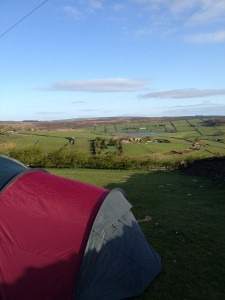

<iframe width="640" height="360" src="http://www.youtube.com/embed/kqvs_bM8QBc" frameborder="0" allowfullscreen></iframe>

Just a quick review of CampEd12. It was great, the events were great. It had a great feel. The food and beer was great. The weather was pretty good and the company was fantastic.

My thanks to Helen Daykin, @Dughall, and Bill Lord for organizing such a splendid event and to everyone that attended it.

CampEd all the fun and laughter you need.

[Read about CampEd12 and Plan to attend CampEd13](http://camped12.wikispaces.com/)

Related articles by other folks..

[http://drbadgr.wordpress.com/2012/05/06/science-at-camped12/](http://drbadgr.wordpress.com/2012/05/06/science-at-camped12/ ) [http://alexbellars.wordpress.com/2012/05/08/camped12/](http://alexbellars.wordpress.com/2012/05/08/camped12/)

_Image courtesy of Dughall_
