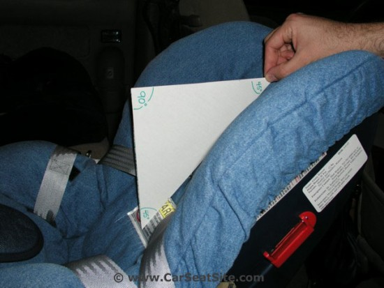
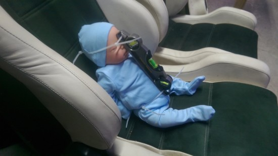
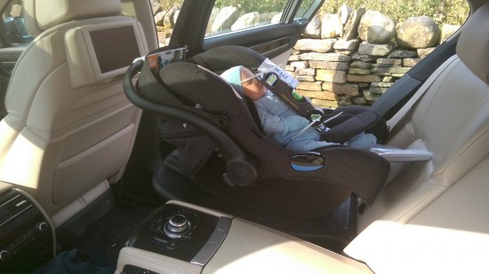
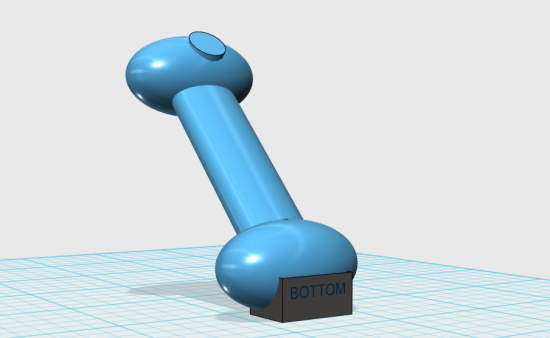
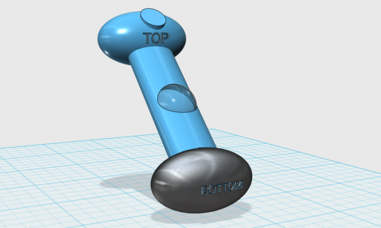
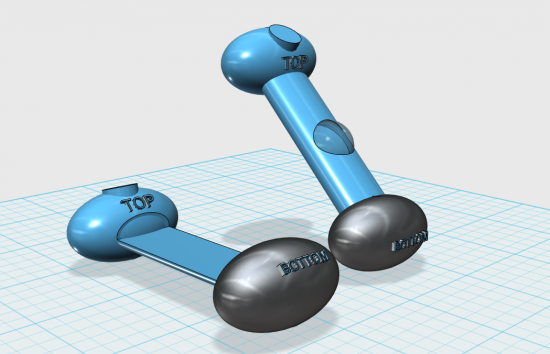
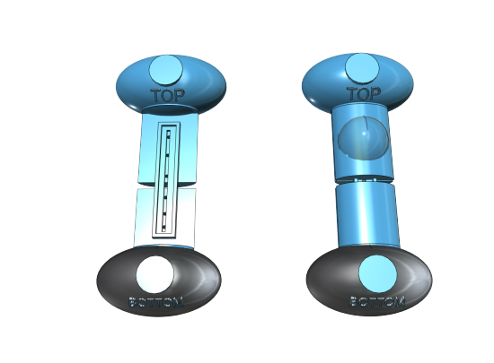
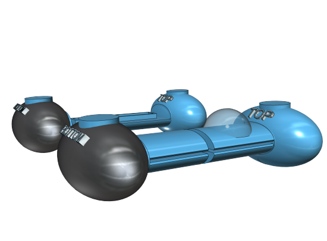

## What's the problem?

Ever been to have a car seat test fitted? Untrained staff try installing seats until they realize the seat they receive commission on is the best for your car.

The staff eye ball the angles of the fit.. Seriously.. Despite various EU laws trying to protect us this is the best a retail experience can provide.

It's not just me who thinks this. [Which Magazine found that 90% of the companies they tested that provide and fit car seats fit them improperly.](http://www.which.co.uk/reviews/child-car-seats/article/car-seat-fitting--which-retailer-is-best)

So while engineers are pulling their hair out developing solutions such as Isofix the final step in the installation completely undermines all of their efforts in the bid for the employee and company to profiteer.

I'm already grumpy enough in retail experiences but when I see something like this I absolutely know something has to be done..

## How are others attempting to solve the problem?

It doesn't take a genius to realize that Test Driven Development comes first in EU car safety so I assume there must be a tool or mechanism for testing the angle of a car seat, alas such a thing does not exist..

The solutions online are substandard such as using a folded piece of paper and again eyeballing to see if it's between 30-45 degrees. BAD Internet.

Some seats come with spirit levels built in which is a start but this again is substandard because it's measuring the angle of the seat and not the angle of the child when in the seat. Still even with this being substandard I think it's probably acceptable if the spirit level is on the seat and not the base.

## What's my solution?

 I bought a baby doll and strapped a spirit level to it..... SCIENCE!

The baby doll was weighted and had a floppy head so I knew this would accurately represent the weight of a baby.. Weight here is important.. Weight causes compression on the bolstering of the car seat which modifies the angle of the baby..

Under testing I realized the baby recline angle is modified between 3-5 degrees under compression.

## Considerations during design

The shape needs to ship well so keeping it as flat as possible on the Z Axis is important. Shipping empty (IE not filled with wafer) and with a low profile will allow keep the shipping costs down.

The shape obviously needs to fit in a car seat and also when placed in a car seat needs to accurately represent the downforce of a child's body and the correct weight of the head. The arms don't really matter so much in this instance because under testing I realized they only have a 0.1 degree impact on recline.

Filling it in a tap should be easy enough so I ensure the water insert is placed in a suitable place.

## Proposed Designs

I know that I need weight in the solution, and I need a spirit level on that solution.. A simple search online helps me discover Spirit level dials then a few hours modelling in 3D design gives me my first draft.. It's basically shaped like a dumbell with more rounded edges.

### V1

The bottom has a rubber section. I haven't decided on the final location for the Spirit level Vial by this point but I imagine on the long central shaft is the obvious location.

### V2

The bottom rubber section is now the entire bottom molding (this can be achieved through a coating). I placed the spirit level vial in the shaft, this allows it to keep with the same profile as the top and bottom sections (again keeping the packaging down). This vial could have Yes/No markers on which make it clear that the angle is good or bad IE > 30 < 45 degrees.

### Water storage

 Here you can see what the water containment looks like and this shows how the "top section" is removable and only there to cover the spirit level vial.

### V3

In version 3 I took into account different heights of children and made the entire unit extendable. 4 Screws are required to attach the bottom and top halves of the unit. The disadvantage to this design is that the user has to fill the top and bottom of the unit but for me that's a fair trade off for the improved functionality. The screws obviously thread into plastic threaded inserts and not directly into the water tank...

### V4

In V4 I added some vanity chamfers to hide / mask where pieces of plastic joined. This is a very old engineering trick everyone does to make joins look intentional however it also serves a purpose here allowing the user to snap off the front covers to be able to access the adjustment screws.

## Conclusion

This isn't a product that I expect everyone will have. It might be useful for people who swap car seats around a lot or have large families but mostly this is a product that would be useful for companies that supply and fit car seats. Giving their customers piece of mind that their installation has been tested for correct recline angle should be common place and at such a low cost it seems like a no brainer for them.

Some seats allow for the angle of recline to be adjusted on the fly. Car seats such as the Joie allow this and I'm +1 on that because each car has a different rear seat angle so it's important to be able to swap the car seat between cars and still have an optimum experience.

Some retailers are toxic. Toys R Us are an example of this. They have inconsistent policies, poorly trained staff and a terrible returns policy that defies EU legislation. At all costs avoid Toys R Us.

John Lewis offer a much better alternative but I'm sure Mothercare etc. are also relatively competent too. **No matter who you go to for a seat fitting, get it double checked, there is a >75% chance it has been improperly fitted.**

## Nay sayers

A lot of more mature parents might read this and think it's a complete waste of time and in some instances I would agree however we live in a world where engineering and solutions to problems are available so if the installer or yourself can use a $10 solution to ensure your seat is properly angled, surely it would be neglectful not to do so? I'm lucky enough to have the means and ability to develop such tools so it would be improper for me to neglect my duties here too.. I ask you this, shouldn't your local fitter have one of these tools just to validate their efforts?

## Q & A

### Why do I need this?

You probably don't. But it might be nice if whoever fit you car seat does have one just so you know it's at the correct angle.

### Why not just use a spirit level on the seat?

The weight/ballast of a passenger modifies the angle they are sat.

### Can I fill it with Whisky instead of water?

Yes, this is an ideal festival accessory..
