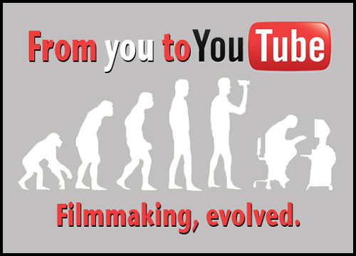

Over the next month I will be working with the [Youtube](http://youtube.com) team trying to implement changes that will make Youtube a safer tool to use in the Primary Classroom.  We managed to achieve a relatively safe Google Search experience through [Safe search](http://primaryschoolict.com) and we hope to copy that successful process over to Video.

[Google TV](http://www.google.com/tv/) and [Primary School TV](http://primaryschool.tv) are both due early 2011 and I expect that within 5 years the majority of TV content will be consumed on demand over the Interwebs.  This means now is the time to address this issue.

I'm pretty confident that if you are reading this blog then you are aware of the issues surrounding Youtube and why children can't use it.  So instead of talking about the issues I am going to simply propose three changes Youtube can make that will make teachers more confident to adopt the worlds largest video resource.

## Allow a Very Safe Search mode

VSS is a Google Search parameter that stands for Very Safe Search.  Youtube's Safe Search is called "Safety Mode".  Safe Search passes this parameter to Google when doing searches and then that users session is always in strict search mode and their is no option to turn this off. **Simply put it's a way to enforce a safer search experience.** What Youtube shouldn't do is expect for a user to login prior to making the experience safer.  This defeats the point.  The current API claims to have a safeSearch mode but I'm not convinced it works ([proof here](http://www.youtube.com/results?search_query=double+penetration&safeSearch=strict)\-- WARNING: Contains explicit material).  Youtube could easily add a fourth category.

## Make Safety Mode more visible

Did you even know Youtube had a safety mode?  To find safety mode you have to scroll to the bottom of the page, you are then reminded it is not 100% accurate.  All in the experience is hard work and doesn't fill one with confidence.   This will be a tough sales pitch as it means altering the UI for everyone.  **Ideally the Safety Mode option would be under "Search options" and only visible when VSS isn't set.**

## **Implement a Custom Search Engin**e

A custom search engine would allow content from certain websites/publishers to be emphasized in the same way that Google Custom Search performs. This will allow third parties to improve the search experience and remove any undesirable content without having to contact Youtube.   Youtube would benefit from this as third parties would pro-actively flag up any inappropriate content, allowing Youtube to optionally crowd source this should improve the Youtube experience.  This will act very much in the same way as Custom Safe Search and will give Youtube the option to allow Educators to remove Ads from content.  **Educators would benefit from this as content from educational publishers would show up higher in the search results.**

**What do you think?** Are there still issues with Youtube that I haven't addressed?  Are you scared of pupils uploading inappropriate videos?  I would love to hear your thoughts, please leave a comment!  I am going to be putting my proposal forward later this week so **all feedback is greatly appreciated! :)**
