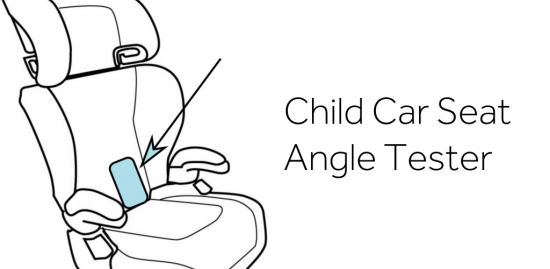

I came to the conclusion that an App solution for my [Child Car Seat problem](https://mclear.co.uk/2016/08/25/car-seat-angle-tester/) would be the path of least resistance with the most immediate impact. This app is free, super simple to use and supports different age ranges.

I only spent an hour or so in total developing the app so please forgive me when you encounter bugs. When you do encounter bugs [feel free to report & fix them yourself](https://github.com/JohnMcLear/Child-Car-Seat-Angle-Tester) as I uploaded all of the source code and released the project under the Apache 2 license (open source).

[Grab the Child Car Seat Angle Tester App on the Play store](https://play.google.com/store/apps/details?id=uk.co.mclear.carSeatAngleTester)

