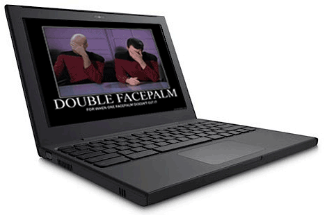

**Want a 30 second summary?  Scroll to the bottom!**

Google released a new [Operating System](http://en.wikipedia.org/wiki/Operating_system "Operating system") ([Chrome OS](http://googleblog.blogspot.com/2009/07/introducing-google-chrome-os.html "Google Chrome OS")) and to go with it a new laptop.  Did you wake up this morning thinking how you need a new operating system or yet another supplier of notebook?  If so, this post isn't' for you.

I'm getting really tired of blogging about [Google's](http://google.com "Google") latest this and that, to the point where I wish they would just STFU for a few months and let us absorb the latest technology.  If I feel like this and I work full time in tech then I can imagine how tired teachers are getting of new technology landing on their desk that claims to make their life easier but really ends up consuming more time.

I'm not bored of tech as a whole, the industry is still great and Google is still a big player so that sort of forces me into a position of having to give a crap.  It was cool when I got of my own ass to give a crap, now I feel like the crap is flicked in my face in a predictable timely fashion.  This poop barrage would be okay if it was targeted specifically at my face but Google are so big that educators jump on every possible bandwagon and we have to develop something new to accommodate their growing needs.  A lot of this development time is wasted as we are simply re-creating something for a new platform in a new language.

**It's not all doom and gloom**.    I love the depth perceptive abilities of [Microsft](http://maps.google.com/maps?ll=47.6395972222,-122.12845&spn=1.0,1.0&q=47.6395972222,-122.12845 \(Microsoft\)&t=h "Microsoft") Kinect and I think that is exciting new tech.  It gives us a tool to solve problems unsolvable before without expensive equipment.  It's a strange world when Microsoft are giving us the breath of fresh air and the technology that really captures my imagination..

## It does what?

**The Chrome OS netbook boots as fast as Windows XP.** BFD.

**Your settings/documents etc are stored on the internet.** This has been available for years and it isn't great.

You are always connected to the internet.  Constant signal with Verizon, are you kidding me?  Does Google actually read any consumer reviews?  I'm in the UK and I know Verizon sucks so bad.  PS I'm already already constantly connected to the internet. **Actually this is pretty cool** but contention is going to be a huge problem if you try this in your classroom.  More than a few devices and the 3G will fall over.  From a business perspective this shows that schools **should preparing their wireless infrastructure**.

**Security built in & auto updates.** I get that with any other OS I use.

**Web apps.** Yea, erm, websites put into some sort of market place..  How is this healthy for the internet as a whole?  Can anyone say sourceforge, tucows, download.com, itunes(spit)?  I'm probably missing something here..  I assume the experience is like Google TV where one creates some web objects specifically with Chrome OS in mind.  An example would be something like Satpin where you would be able to cache a lot of the data locally, but erm, wait, there is no disk.  I'm also expecting the [Chrome Web store](http://blog.chromium.org/2010/05/chrome-web-store.html "Chrome Web Store") is open for anyone to publish to assuming you don't care for your Oprah(spit), IE and Firefox users.

The device will probably be free on contract in late 2011 and enter an [already saturated market](http://www.carphonewarehouse.com/laptop-redirect).

## A warning to grand parents

Don't end up being the one that has this conversation...

Grandparent: "Grandson I got you one of these netbooks".

Grandson: Oooh sweet now I can play [Diablo 3](http://www.blizzard.com/diablo3/?rhtml=y "Diablo III").

Grandparent:  It's one of those Google ones, I saw Google on your screen the other day so I knew you would like it....

## You talk a lot of crap John..

So here's the thing, from now on I'm only going to talk about problems that Google actually solve that need solving.  When it comes to operating systems they are few and far between.

I think that [Google Chrome OS](http://en.wikipedia.org/wiki/Google_Chrome_OS "Google Chrome OS") is basically Google's first troll product.  Troll in the sense that it doesn't fix any required problem but upsets a crap load of other players in the industry.  Safe to say you wont be able to play Diablo 3 on it so I won't be buying one to replace my main laptop/notebook.

On the topic of me talking a lot of crap it is kinda needed once in a while.  I know a few Google staff members and we have a lot of open and frank discussions about different technology.  While I am an expert in no specific technology I try to get across the needs of a child in a classroom and at home.  Google is a big company but if you kick it hard enough it does react.

And what the deuce is with 3G only.  Wasn't it about 4 years ago we figured out 3G wont scale to modern demands, did they go and re-create 3G without telling anyone?

**Brief summary**

1. It's a pay monthly device through your mobile phone provider.
2. It does nothing new for you that your current computer doesn't do(probably).
3. The 3G will be useless in a lot of classroom scenarios.  Your school will need a good Wifi system.
4. It will make accessing facebook easier and more reliable.
5. Parents will probably end up buying kids one of these.
6. It will make your life difficult initially if you are a power user.  Let's face it if you are a power user and loathe MS/Apple then go [Ubuntu](http://www.ubuntu.com/).

