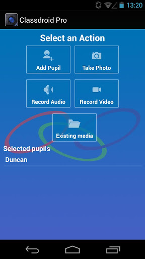

 Today [PrimaryT announced an update to Classdroid](http://blog.primaryt.co.uk/2013/02/05/classdroid-2-0-and-classdroid-pro/) that ads some staggering new functionality.

New functionality includes

1. **Record Video and/or Audio**
2. Attribute Work To Multiple Pupils
3. Mutliple Grading Schemes (0-5 Stars, UK KS 1-3 Levels, UK EYFS)
4. Group Pupils
5. Upload Media Recorded On The Device Outside Of Classdroid
6. Use Proxy Settings

