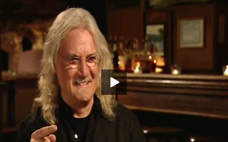

[Russell Howard](http://www.russell-howard.co.uk/ "Russell Howard") is funny right? At least I think so.. I also think that Billy Connolly is funny but is his "strong" use of English appropriate for Primary age kids? Probably not.. This has posed a new problem for our Safe Search filter..

Sure we can check meta content such as comments and categories for profanities but most video content doesn't have subtitles completed yet and let's face it no engine [Google](http://google.com "Google") can write will ever be able to detect [curse words](http://en.wikipedia.org/wiki/Profanity "Profanity") delivered by the [Glaswegian](http://maps.google.com/maps?ll=55.858,-4.259&spn=0.1,0.1&q=55.858,-4.259 \(Glasgow\)&t=h "Glasgow") king of comedy..

## So what are my options?

I can block comedy..  Here are the current search results on [Primary School TV For Billy Connoly](http://primaryschool.tv/search.php?q=billy+connolly).  Kudos to Paul Scott for pointing this out.  I'm tempted to email Billy to see what he thinks.  Would he deem his [stand-up](http://en.wikipedia.org/wiki/Stand-up_comedy "Stand-up comedy") appropriate for 5-12 year olds?  I doubt it.

Or I can block stand-up..  Blocking either of these makes me feel a little dead inside..  I mean, as a kid..  I LOVED comedy & stand up..  Yep it was a bit offensive at times but non of it made me a lesser person..  So here is my compromise..  If a kid wants to get to video content containing stand up they can still search for it using Safe Google Search and find it through there but I am removing the video content from [Primary School TV](http://primaryschool.tv)...

## To summarize.

Stand-up is being removed from [Primary School TV](http://primaryschool.tv).  Sorry, I know this sucks..  I will review it in a few months to see if any useful edu content has been filtered....

Note:  TED talks for example are not classified as stand-up.

###### Related articles

- [10 useful free services for UK Primary School ICT Co-ordinators](https://mclear.co.uk/2011/01/23/10-useful-free-services-for-uk-primary-school-ict-co-ordinators/) (mclear.co.uk)
- [Primary School TV - Hello world](https://mclear.co.uk/2011/01/15/primary-school-tv-hello-world/) (mclear.co.uk)
- [Changing Youtube to get it unblocked in the Primary Classroom](https://mclear.co.uk/2010/10/13/changing-youtube-to-get-it-unblocked-in-the-primary-classroom/) (mclear.co.uk)
- [Primary School TV show RSS feed](https://mclear.co.uk/2010/10/30/primary-school-tv-show-rss-feed/) (mclear.co.uk)

