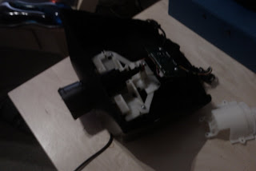

  

Pre Reqs:

- A steering wheel gaming controller
- 20 minutes spare
- A car steering wheel
- A snap on Hub
- Saw that will cut through plastic
- Screwdriver

  

Instructions

1. Remove casing
2. Removing housing of Steering wheel
3. Cut Steering wheel collumn (from game wheel)
4. Drill 2 holes for snap on hub to snap into
5. Put it on
6. Test
7. Screw back together
