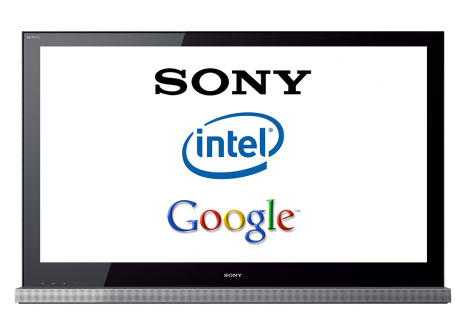

Ever owned an android phone that has been **late to receive an Android update crippling some functionality?** It is pretty frustrating. **Your TV may have same issue**. In the future when a new great game is released and the only way you will be able to play it is by getting an entire new TV. Google apologize because an update for your TV is not available due to Android hardware restrictions. Sony point at Google. Sony win because you buy another TV.

Sony's new TV potential poses this exact problem, it runs Google Android and it is speculated that it has the same processor as the Motorola Droid. I'm a big fan of Smart TV as a whole, I just hope that Google / Sony were smart enough to allow modular upgrades of the Android device.

It would be awesome if the big TV players could develop an open standard so other operating systems, not just Android could leverage the warm glowing screen in our living rooms. It will also be interesting to see if any camera functionality is build in for video conferencing and for Kinect like control.

Sony you are in charge here, make it open and the community will do the rest. Note: Please no comments about Android being O/S. I know it is, but that doesn't mean there is choice if the TV platform is closed.
