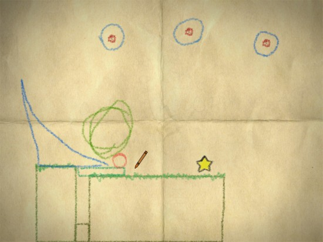

[Crayon Physics](http://www.crayonphysics.com/) is a download/install game, I received it as part of the humble indie bundle which cost me ~$5 for 4 games. There is a windows, mac and linux version.

There is no right or wrong answer to any of the puzzles and each buzzle is really bite size making it ideal for learning about shapes and space &forces. The design is perfect for kids and even at 20$ I think it's a bit of a bargain.

[Grab the demo now and see if you like it!](http://www.crayonphysics.com/download_demo.php)

<iframe src="http://player.vimeo.com/video/1849263?title=0&amp;byline=0&amp;portrait=0" frameborder="0" width="550" height="400"></iframe>
