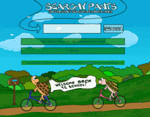

 Searchy Pants is a new exciting way for schools and parents to create [their own safe search home page](http://searchypants.com/getyours.php).

We focused on three main benefits:

1. Include your family/schools branding/logo
2. Include a message to your kids/pupils/teachers
3. Include useful links

We kept the admin interface as simple as possible (Just 3 pages and a wizard style setup)

Please do [sign up and test it](http://searchypants.com/getyours.php), we are happy with it so far but we know that feedback over the next few months will get us to a point where we can do a formal launch to all schools.

We kept Searchy Pants as safe as possible with various bits I will talk about in the future, most of you will be aware of the [Safe Search](http://primaryschoolict.com) engine we have maintained for the last 4 years with great success.

SearchyPants is pronounced - Ser Chee Pants  - Like SmartyPants but that domain was gone :P

Thanks to [Matt Lovegrove](http://twitter.com/mattlovegrove) for the testing so far.  If you think Searchy Pants is a good idea then please share it!
