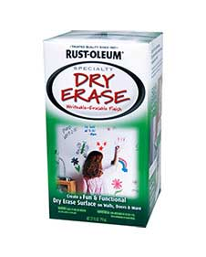
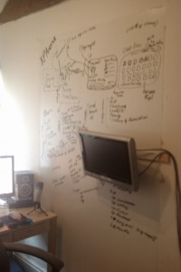

 I bought some of [this paint](http://www.rustoleum.com/CBGProduct.asp?pid=128) from Homebase when it was on special offer.  The paint basically allows you to use a dry wipe marker on your wall.  I used it to make notes and the like (see right hand side)...  So far, so good.  
It seems to be working well.  I'm tempted to do the rest of my walls.    
  
One thing to note:  Prepare your surfaces well, just a quick scotch down of most surfaces wont do.  Also ensure you don't have any hot lights beaming down on your surface as it may make the paint dry a bit funny..

Next step is to try it with one of these [Epson projectors](https://mclear.co.uk/2010/03/29/new-iwbless-epson-projector-dont-impress-me-much/) that don't require an IWB.

###### Related articles by Zemanta

- [Epson and E Ink Announce State-of-the-Art Color EPD Controller](http://www.physorg.com/news193669730.html) (physorg.com)

![Reblog this post [with Zemanta]](images/reblog_e.png)
