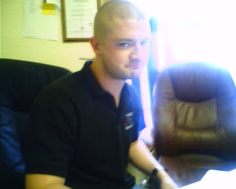
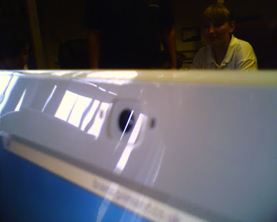
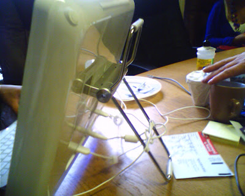
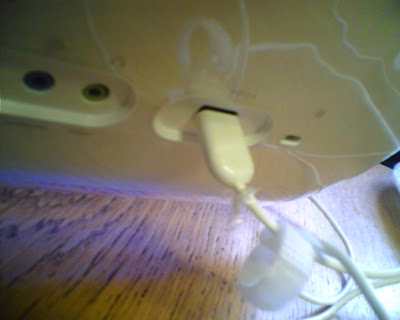
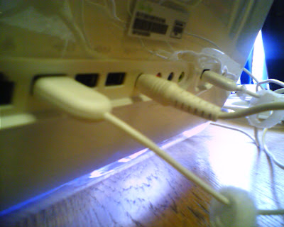
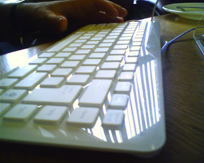
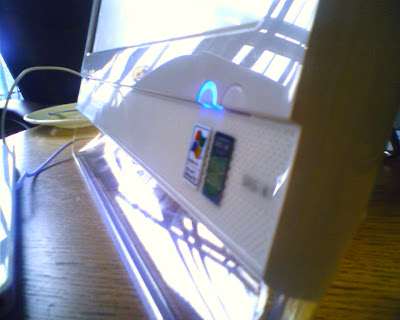
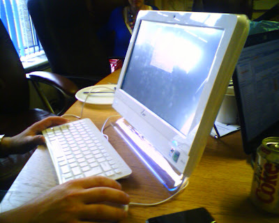

Had a demo of the EEE desktop in our office today.

  

The unit was sent to us to use in a primary school. They cost about £340 exc vat or so.

  

My only beef, no VGA/HDMI output on the model we had :( This may not be accurate for all models.

  

  

But first meet our moody Engineer aka Cuddles

  

  

webcam

  

handle

  

clean -\_-

  

cables + ports

  

low profile kb

  

slick design

  

save desktop space
