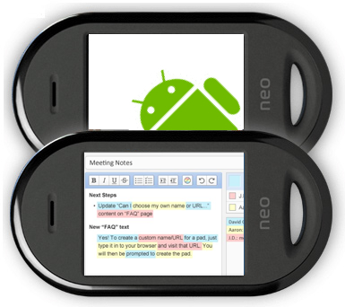

 **This isn't working yet**, nor is it working on the iphone.  It is because the web browser that comes on these devices does not have the correct support for the Etherpad objects.  You can however view pads in read only by browsing to the usual URL.

We expect more mobile support in **late 2010** but it may not be something we can change server side, it may be dependant on the client device browser implementing **[designMode](http://msdn.microsoft.com/en-us/library/ms533720\(VS.85\).aspx)****.** [Opera Mini](http://www.neowin.net/news/opera-mini-5-beta-released) now has partial support for designMode however I haven't tested Etherpad with it. \*Update 31/03/2010 - [This doesn't work](https://mclear.co.uk/2010/03/31/opera-mini-5-beta-designmode-support-is-very-partial/)

iPhone claims to have support for this but of course it [doesn't work](http://stackoverflow.com/questions/335240/iphone-designmode-support).

Android's web browser is built on the [WebKit](http://en.wikipedia.org/wiki/WebKit) application Framework.  Optional browsers [Steel](http://www.kolbysoft.com/) and Dolphin do not appear to support [designMode](http://msdn.microsoft.com/en-us/library/ms533720\(VS.85\).aspx) at current.

Find out more about [Etherpad](http://etherpad.org)
