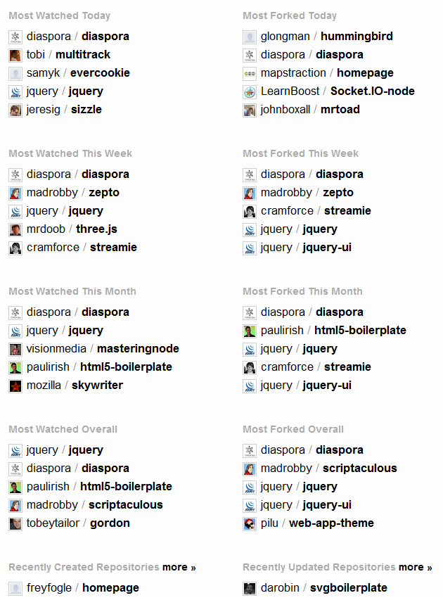

I keep forgetting the name of the damn project and I always type it into Google wrong.  Anyway.  Diaspora has momentum.  And it looks like a Ruby project too?

Looks like Ning/Edmodo etc. have their work cut out competing with this open source monster.  Although we have been here before with open source/free social networks.  I feel a touch of de ja vou.  Wasn't there a project called open social or something?  Anyways..  If you care, good for you.  Social networks aren't productivity tools.

###### Related articles by Zemanta

- [Diaspora vs. BuddyPress: Open Source Social Networking Matchup](http://pressography.com/wordpress/diaspora-vs-buddypress-open-source-social-networking-matchup/) (pressography.com)
- [Facebook Competitor Diaspora Revealed](http://developers.slashdot.org/story/10/09/16/1245236/Facebook-Competitor-Diaspora-Revealed) (developers.slashdot.org)
- Open source, open Facebook "killer" Diaspora code is out (currentbuzz.org)
- [Open Source Facebook Contender Releases Code to Public](http://www.wired.com/epicenter/2010/09/open-source-facebook-contender-releases-code-to-public/) (wired.com)
- [How Diaspora killed itself before it even launched](http://jarinheit.posterous.com/diaspora-or-how-to-kill-your-facebook-killer) (jarinheit.posterous.com)

