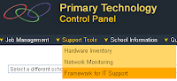
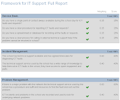
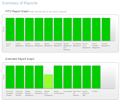
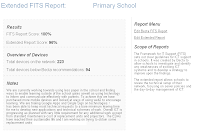

We felt that the FITS (Framework for ICT Technical Support provided) could be modified to more embrace the specific needs of a primary school so we decided to create an extended version of the framework for all UK schools to use.

  

Completing an extended FITS report from your school will fulfill a lot of SRF requirements and is appreciated by OFSTED. We have had great success using this platform in Bradford and would like to share our findings.

  

We use the framework to ensure that schools can plan ICT activities and expenditure over the next 3 years and also ensure that if any school encounters any loss of quality of service.

  

You can complete an eFits for your school. The service is completely free and is very easy to use. To access the extended fits simply:

1. Register/Login at [Primary Technology ontrol Panel](http://crm.primaryt.co.uk/crm)
2. Click Support Tools then Click Framework for IT support
3. Fill in the form and click OK

More reading on FITS (becta website)

[More reading on services from Primary Technology](http://primaryt.co.uk/)

  

Screen shots of a report:

  

  
