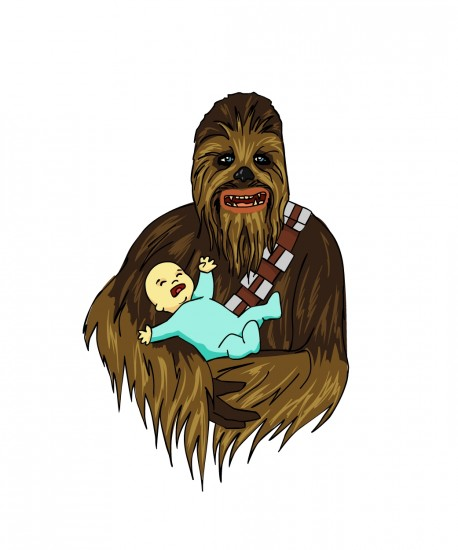

TLDR; I'm announcing my retirement from actively maintaining [Etherpad](http://etherpad.org).

The Etherpad project is great and will continue to go on without me, I have no doubt of that.

4 years, 100+ plugins, ~30k lines of core code and ~1.5k core commits is in my opinion a decent contribution to open source and an open web.

Etherpad is the only editor that provides a truly fully portable full fidelity document.

Over the past few years several other fantastic collaborative editors have risen and fallen, Etherpad will continue to exist and once it finds the right home and assigns the ideal project lead it will flourish. On top of Etherpad a lot of my time was dedicated to my [other projects](https://mclear.co.uk/sites/).

My plugins will be all moving over to the Etherpad foundation Github organization on the 1st of September.

Special thanks to Automattic, Wikimedia, Mozilla, UN, Nato, Storytouch, OGF and other major individual contributors such as Peter, Rob, Egil, Aaron. I can't thank you all enough for being part of the journey :)
