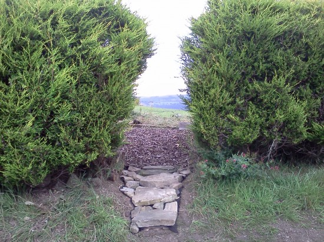

August for me is all about gardening, I try to have as much of a disconnect as possible. This year has been the hardest year so far though as PrimaryT has 3 ongoing legal cases and the Etherpad foundation is due a launch on the 22nd so that's really eating into my summer holidays. Never the less I'm managing to get into the garden and my "must complete" tasks are all done I can get onto doing some of the landscaping I have been putting off for a few years.

I'm pretty happy with our achievements this year, discovering new sources for firewood and other materials have been a huge bonus and my friends/neighbours/family have been a huge help. I also have a contractor working on the site and despite him banging away from 8am I'm still able to sleep pretty well, looking forward to having a slightly warmer house this winter than last and I hope that soon it will begin feeling like an ideal environment to have frequent visitors on a more regular basis!
