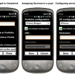

Flip cameras are dead.. Yep. You [read that right](http://edition.cnn.com/2011/TECH/gaming.gadgets/04/13/cisco.flip.flop.wired/index.html?eref=rss_tech&utm_source=twitterfeed&utm_medium=twitter&utm_campaign=Feed%3A+rss%2Fcnn_tech+%28RSS%3A+Technology%29).. Cisco have killed the product/brand/company.. Why? Because everyone is using mobile phones to capture video and images.. So what choice do teachers have? How about a nice little app for android phones called [Classdroid](https://mclear.co.uk/sites/classdroid)? It's free and is written specifically for teachers.. G'wan.. Give it a go today, search for classdroid on your phone or install it via the market place.

###### Related articles

- [Cisco to close Flip camera unit as smartphones swallow its market](http://r.zemanta.com/?u=http%3A//www.guardian.co.uk/technology/2011/apr/12/cisco-flip-camera-smartphones&a=40702163&rid=98a2fb53-892d-4d1d-aa8a-1cb40d479412&e=12caae4a2fca0810caa1c9f64be1683e) (guardian.co.uk)
- [Flip Camera Flops As Cisco Fires 550 Employees - Who Is Next?](http://www.lockergnome.com/reflections/2011/04/13/flip-camera-flops-as-cisco-fires-550-employees-who-is-next/) (lockergnome.com)
- [The end of the Flip as we know it?](http://www.onemanandhisblog.com/archives/2011/04/the_end_of_the_flip_as_we_know_it.html) (onemanandhisblog.com)

