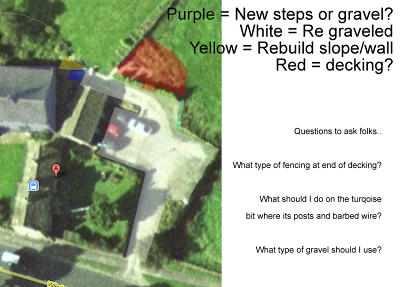

  

These are Scottish Pebbles, I will prolly use 40m2 of them which will prolly be about 4 tonnes.

  

 <-- This is the other option for gravel (Cotters Gold)

  

I'm considering the options for the fencing (where we currently have like 8 posts and barbed wire and im considering getting a dry stone wall built, im a bit worried that about 30ft of dry stone walling won't be cheap :P

  

I'm also considering not using wood decking but stone as it will be less hard work to maintain
