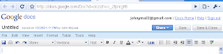

Does anyone know if its possible to change the interface on google docs to a more simple interface with less toolbars?

  

This is how it looks by default:

  
  

This is how I'd like it to look if I were to have pupils use google apps:

  

