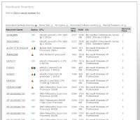
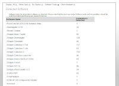

Performing a hardware and software in your school can be a long, boring & time consuming task. Well not any more! Primary Technology have released publicly our web2 application which is incredibly easy to install and gives you real time information on what software is installed.

  

Included in the tool is a Becta recommend minimum requirements comparison tool which allows you to see which machines you may need to replace in the next 12/24 months.

  

Screen shots:

  

Hardware inventory

  

  

  

  

  

  

  

  

  

  

  

Software inventory

  

  

  

  

  

  

  

  

  

To access the Inventory tool visit the [Primary Technology Control Panel](http://crm.primaryt.co.uk/)
