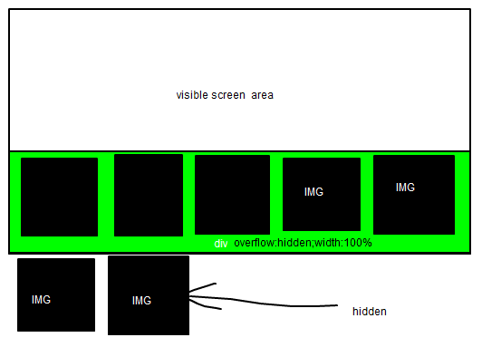

[](https://mclear.co.uk/wp-content/uploads/2010/12/blah.png)

The title of this article is horribly lame but it's what (after a few beers) I appear to have Google'd for..  Basically you have a div, 800px wide and you have 16 images, all 100px wide and you want to only leave 8 images in the active dom.  I bet you are thinking..  Yea just use \[code\]overflow:hidden\[/code\]..  Sure..  But you can still tab to the images and that sucks if you are making a TV website where the users may be using a remote control...

**So here's how I did it..  Using javascript..**

1. Set an incremental id value on each image, IE img
    
    ```
    id=image1
    ```
    
    ...  image2, image3 etc.
2. Get width of div
3. Divide width by amount of px.
4. Now you have total amount of objects you can show
5. For each of the 16 images if the amount of images available is less than 16 then set it to
    
    ```
    display:inline;
    ```
    
    else set it to \[code\]display:none;\[/code\]

Display none stops the object from existing on the screen what so ever..  It's not hidden so you can't tab to it..  This also works with divs that can be resized..  What you do is listen for resize, when a resize event is triggered get the new div width and run the function to hide/display the images..

If you know a better/cleaner way of doing this then please let me know :)
