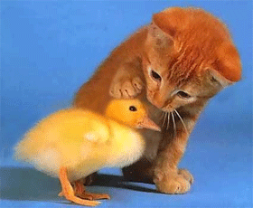

I have been in touch with 15 illustrators over the past 10 weeks because [Primary Technology](http://primaryt.co.uk) has put some money aside to do some new illustrations for [Safe Search](http://primaryschoolict.com).  I have been a bit surprised with the responses....

I sent out a tweet asking for contacts and got a whole host of illustrators lined up to do the work,  I then sent each of the illustrators an email with my requirements and stated that we could pay for an example piece.

My current illustrator is fantastic and has done nearly all of the artwork you will see in Primary Technology products.  All the way from the [School Email Wizard](http://schoolemail.co.uk) through to the animated graphic on this blog.  He does rough drafts & quote for each piece and if we like it we give him the green light to go ahead.  In fact every artist I have ever worked with has sent through a rough draft prior to even discussing payment.  This includes artists from all around the globe.

The work is a great opportunity for children book illustrators to have their brand and style visible, surely illustrators are aware that culture is all about influence and to have a great deal of influence (40k views a day) is pretty useful for their career?

So far out of the 15 illustrators only 2 have sent through rough drafts and many have requested payment prior to even creating a rough draft.  Is this normal?  Do illustrators really think that their reputation is enough to be payed just to send a rough draft/idea through about some work?  As someone that does a bit of web design work I never ask for cash up front, I always get paid for delivery and if the customer isn't happy I never charge.

Anyway, I have the money so I'm going to pay to see rough draft pieces even though I think it's backwards.  If I'm not happy should I ask for my money back?
