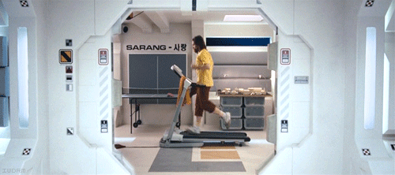

Technology can be used to solve so many practical problems, I'm curious to find out what technical problems teachers actually want solved.

I'm not expecting actual answers, I just want to get people thinking.  I have 3 days of AGM meetings and part of our AGM is trying to predict the market place for 3 years. I loathe the fact classroom technology is treated like a market place but recognise it is a necessary evil so I try to do as much as I can to speak to as many pupils and teachers as possible to voice your thoughts.

The announcement of the additional capital for "free school meal" pupils got me thinking about this.  I wonder how many schools will spend that money to buy one computing device per child and/or how many people think that computer technology can actually be used to improve a child's education.

If you had unlimited funds and computer could do anything you want, how would you use that resource?

A lot of products come out promising to be solutions of this and that but I have learned that the most useful pieces of technology are simple, easy to adopt tools with no barriers.  Solutions tend to be the bane of most teachers existence.  Am I alone in realizing this?

###### Related articles

- [Look, But Don't Touch: Student Access to Classroom Technology Limited, According to CDW-G Study](http://eon.businesswire.com/news/eon/20100628005246/en) (eon.businesswire.com)
- [How do we shift teaching and learning pedagogy to a 1:1 computing environment?](http://annmic.wordpress.com/2010/12/08/how-do-we-shift-teaching-and-learning-pedagogy-to-a-11-computing-environment/) (annmic.wordpress.com)
- [Cellphones in the Classroom: Distraction or Tool?](http://www.readwriteweb.com/archives/cellphones_in_the_classroom_distraction_or_tool.php) (readwriteweb.com)
- Are schools putting kids off computers? (postgrad.com)

