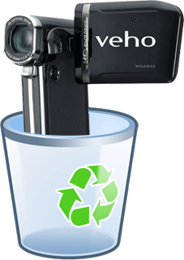

 As you may know I'm reviewing [13 digital cameras](https://mclear.co.uk/2010/02/17/let-the-recording-begin/) with local Primary Schools, I'm about 1/2 way through capturing all the software procedures and decent shots of the cameras but the last 2 cameras have made me lose the will to live.

Stupidly I played with the Kodak, Creative and Flip cameras first and had a [reasonably good software experience](http://youtube.com/johnyma22).

Then I got out the two Veho Kuzo cameras and it's like going back 10 years in camera technology.  The software is on a CD instead of on the SD card in the camera, the software sucks and requires a restart also these cameras DO NOT actually record HD or if it is HD then it is probably the worst HD footage ever shot.  With that in mind I'm dropping the Veho cameras from the set and excluding them from further tests.  They receive a score of F for #fail.  I wouldn't recommend either of the Veho cameras to schools.

Turns out the Toshiba Camileo P30 is in exactly the same boat. What a conundrum, at this rate I will only have 9 cameras left to give out to schools!
