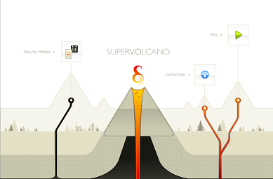

I have submitted [some volcano games](http://primarygamesarena.com/search.php?q=volcano) to [Primary Games Arena](http://primarygamesarena.com).  Click here to see a list of [Flash Volcano Games](http://primarygamesarena.com/search.php?q=volcano) that can be used in Primary School lessons and home.  I was hoping I could have a widget wrote today that would include all the games inline on this blog post but I keep getting distracted by people wanting to use my laptop to check their flights are still flying.

## [The games are here.](http://primarygamesarena.com/search.php?q=volcano)
