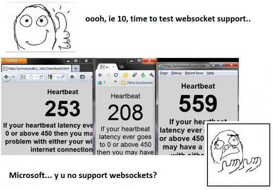

Internet Explorer 10 preview came out today and it doesn't support websockets which is a huge shame :( Chrome does, Firefox supports them but it's disabled by default.. Others also support Websockets.

Websockets makes your internet experience better by giving you the ability to have faster data responses on websites. This means that really-real time web applications such as [Etherpad](http://etherpad.org) and [PrimaryWall](http://primarywall.com) can be adopted easier.
