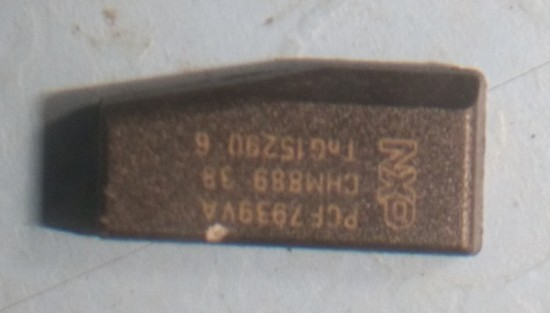

The Jaguar F-Pace Activity Key Wristband can be used to unlock your car. You leave your key in the car.... It was covered in Grand Tour and it seems like a good optional extra until you scratch the surface..

The IC used in the Jaguar F-Pace is an:

> NXP PCF7939VA CHM889 38 TnG15290 6

The reason the User Experience is so poor with this device is because the wristband IC antenna implementation is poor. Instead of designing an antenna and IC and creating an inlay Jaguar used an off the shelf component ergo the IC antenna is not matched well to the reader antenna.

This implementation was a quick hack job but a commendable first effort. I hope to see Jag work with the likes of NXP to sort this in future iterations. There are various inlay manufacturers who could provided a much better solution and probably as quick as Jaguar required to Jaguar's requirements. The reason Jaguary didn't use these inlay manufacturers is probably because moving big companies like JLR to use new suppliers and get all of the hardware requirements properly setup is a very slow process. This solution is basically the DELL/IBM approach and the UX suffers because of it.

[A replacement wristband costs ~$200](http://gear.jaguar.com/gl/en/f-pace/interior/function-technology/t4a11596-activity-key-wristband/), [kinda harsh for $2 of IC](http://www.digikey.com/product-detail/en/nxp-usa-inc/PCF7939VA-CABC0600/PCF7939VA-CABC0600-ND/3430991).

I don't know if you can program your own PCF7939VA modules, that would be a nice feature as the wristband kinda sucks and the UX would be a lot better if the module wasn't in the wristband.. Please comment if you know if it's possible to add new wrist bands(modules) to your car without Jaguar dealership involvement.

I don't know if the reader hardware is installed in the car without the optional extra, that'd be nice to know! Please comment if you know...

According to the dealerships I have met they have mentioned about 30% of purchases are including this optional extra. The general consensus on the Internet is that the UX is poor but there is obvious demand so this looks like a good growth area for the likes of NXP and JLR.

Leaving your key in the car creates all sorts of problems. Consider someone smashing a window, taking your key and starting your car, according to Jaguar this isn't possible but I'm very skeptical of that claim. A much better solution would be leaving your key at home or putting your key in a secure environment that locks when the wristband is used to lock your car.

Disclaimer: This was a personal project.
