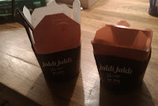
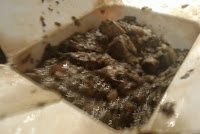
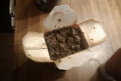
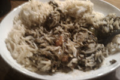
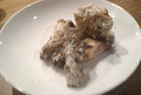

  
  
  
  
  
  
  
  
  
  
  
  
  
  
  
  
  

  

Random piece of information: Jaldi translated to English = Soon

  

Jaldi Jaldi is Mumtaz' latest brain child. After Mumtaz' success in the supermarket chains and their huge revenue growth the Mumtaz chain have made a brave decision to weather to current social climate.

  

**The branding is very well done**.

  
Mumtaz is not the most popular curry house in Bradford,

the curry house serves mostly visitors to the City with local people tending to opt for less commercial curry houses such as the [Sweet Centre](http://www.sweetcentrerestaurant.com/) or [Akbars](http://www.akbars.co.uk/).

**  
The Starters were too hot & Curry was too cold. The chicken curry was not thoroughly reheated.**

  

**Should chicken be reheated?** Subway do it.. Short answer is yes.

  

**Has this devalued the Mumtaz brand?**

  

The curry tasted fine but it was disappointing that you couldn't get a chipatti or roti version and that rice was compulsory.

  

You would struggle to actually eat it "on the go" in the same way you could a sandwich or burger and the cardboard container absorbed quite a lot of the grease and moisture leaving a **rather unpleasant appearance**.

  

**Jaldi Jaldi is a great idea**, and the concept is fantastic, the execution is lacking a bit of refinement. The prices were too high and at some point laughable especially by the majority of the Asian community in Bradford who are used to much better value for money when purchasing curry.

  

The staff at the Bradford Forster Square shop were very polite and helpful. The whole experience was very easy and hastle free. I think that Jaldi Jaldi will do a good job catering for local shoppers and workers in the Forster Square area.

  

**Would I take a friend to Jaldi Jaldi to eat?**

Nah, Bradford has far too many good curry houses to rush a good curry. Curry as fast food to me and my friends is not a popular concept. **Why would you want to rush something so beautiful and pleasant?**
