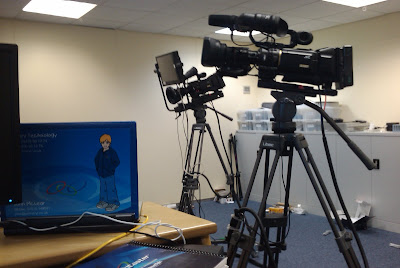
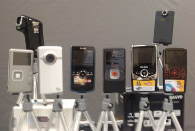

  

  
This week we made a start on recording footage for the digital camcorder reviews. Above you can see the cameras we are using.

  

We have designed semi scientific tests to gather our information, below you can see a selection of cameras lined up to catch a shot. Spot the obvious mistakes..

  

Some tests were so scientific and just required a box, a camera, a tripod and a clumbsy operator..
