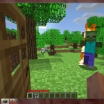
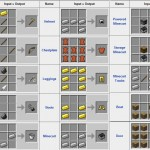

UPDATE: It's not just me who thinks Minecraft is great, [so does Leon!](http://msfyr5.primaryblogger.co.uk/fun-stuff/a-game-that-you-guys-should-play-if-you-want-to/ "Leon writes about Minecraft")

[Minecraft](http://minecraft.net/) is an online game, the free version isn't multi-player.  Minecraft can be played in your web browser (when it's up).  Minecraft requires Java (not the usual flash software).

## Minewhat?

Minecraft is a first person survival game.  You must manipulate elements/resources to survive and construct your own world.  During the day everything is fine and peaceful, you spend this time constructing and crafting a safe environment because at night is when the dangerous beings come out to attack you.  Admittedly this may be a bit scary but as its 8bit and its not exactly grand theft auto graphics I'm sure it can be classed as "U" rated or at most "PG".

## So, where is the education value?

Well, mostly in the crafting section of the game.  Trying to persuade you that control and/or the day/night thing is educational would be a bit far fetched and I try to treat my readers with respect.  The crafting part of the game basically asks you to merge certain elements to create new materials.  For example, you turn wood into planks, planks into sticks then craft 2 sticks and one piece of coal together to create a match.

## This game is a baby puncher.

Don't expect for this game to be easy, in fact it's tough!  Watch below for a video on how to survive your first night!

Minecraft has been buggy so they released a free single player download version, how nice of them is that?  This is the [current download link](http://www.minecraft.net/download).  I haven't played the multi player yet, I'm not sure on the child protection issues surrounding this.  I guess like any other MMORPG (of sorts) it will have the ability to chat etc.  Private educational collaborative servers could be an option though?  In the mean time I'm getting in touch with the developer to see if we can get some free educational access so we can try it out in a few schools.

What do you think?  Is this more a primary or secondary tool and other than geography what subjects does it complement?
