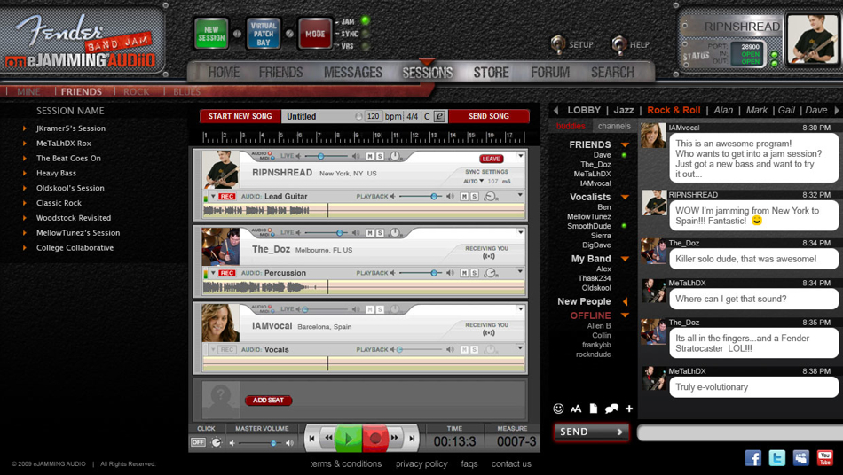

**Update: I am working with the CEO of eJamming to try to address some of the issues I encountered - Watch this space.**

 [eJamming](http://ejamming.com/ "eJamming") audio is a 10$ per month service that allows you to [real-time](http://en.wikipedia.org/wiki/Real-time_computing "Real-time computing") jam with your mates via the power of the internet.   **Or so it claims**..  Heres what I found...

## Sign up

I found the sign up process a little too **intrusive** and cumbersome, even the verification email took about 5 minutes to come through. There was no message stating I had been verified, after clicking on the email it just  redirected me back to the download page. The link to speedtest.net should really open in a new window - removing me from the website at a critical moment seems like a bad idea and th link to HTTP://PORTFORWARD.COM/EJAMMING/  isn't clickable and it 404's when types in the address bar & the port forwarding docs aren't clear, but whos are?  Ideally port forwarding wouldnt be required.

## Getting started

Initially the ASIO4ALL application **broke all audio playback** on my system, I had to fiddle with audio setings to get it work again. The desktop app doesn't fill the available space on screen which makes my widescreen monitors feel a bit wasted, also the File, preferences window didn't even open on my main window (it opened else where) and _just for fun_ the app **dumped** a .txt file and .xml file on my desktop.  I feel like the preferences should be part of the main control bar and not hidden away.

## Joining in

Some sessions would let me in for a few seconds then drop me out not give an indication of why but what is worst is that most of the sessions just wouldnt allow me to connect at all.

## Summary

Basically this service didn't work for me.  I wish it did because I love the idea and I hope they are able to fix all the bugs/issues because I think it could be great =)  I emailed a link to this post to the support team in a bid to get things improved.

Note: I have a 3MB orange internet connection, I get about 3Mbps down and .38Mbps up.

