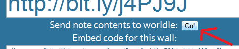

This is a short tale that will tell you exactly why people like me need to go to Teachmeets.

I rocked up at Teachmeet, flyers out, brain on, willing to listen. The talks were all great and then @largerama got up and showed something similar to [PrimaryWall](http://primarywall.com). Brilliant, I thought, because it wasn't as nice as [PrimaryWall](http://primarywall.com) but he showed 2 features PrimaryWall doesn't have!! Oh noes!! Export to Wordle and another one that is coming soon, sssh(secrets)! Anyway.. Long story short, I was at TM on Thursday, I did 30 minutes implementing the new wordle feature today and it's now live... 30 minutes!! That's all it takes for a great idea to end up on a great platform.. Kudos to @Largerama, he is a genie's bum!

The functionality is available for both pro and basic accounts. [PrimaryT](http://primaryt.co.uk) will make a formal announcement later this week hopefully once all the CSS is polished etc.
