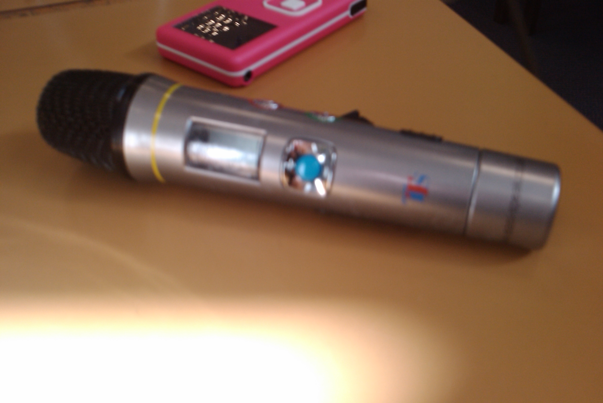

This new TTS microphone for classroom use has the usual handy USB port on the bottom and easy record/playback of last clip.  I did find using it a bit fiddly and some of the buttons feel super tacky.  Great choice for KS2!  Not sure on availability/price.  Want to see other options?  Check out my [top 5 microphones for classroom use](https://mclear.co.uk/2009/12/14/top-5-microphones-to-use-in-a-primary-school-classroom/ "Classroom mic review").
