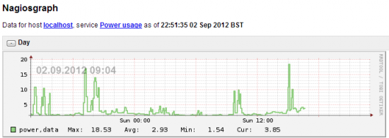

I have been able to get my CM160 owl energy monitor to provide data to nagios. This allows me to track energy usage in my house.

It's disgraceful how bad Owl's support is for linux users but it's great to see the community being so active in writing drivers/support to make it a reality.

Here is my check\_owl.sh - I run this as a nagios command: \[code\] meh=\`tail -n 1 /var/log/owl.txt | cut -d' ' -f7\` /usr/bin/printf "power is $meh | $meh" exit 0 \[/code\]

Replace the path /var/log/owl.txt with your owl output log file.

To test it do: \[code\] tail -n 1 /var/log/owl.txt | cut -d' ' -f7 \[/code\]

You should get a value as a response.

My nagios command(commands.cfg) looks like this: \[code\] define command{ command\_name check\_owl command\_line /usr/lib/nagios/plugins/check\_owl.sh } \[/code\]

and my service like this: \[code\] define service{ use generic-service ; Name of service template to use host\_name localhost service\_description Power usage check\_command check\_owl!20!5 action\_url /nagiosgraph/cgi-bin/show.cgi?host=$HOSTNAME$&amp;service=$SERVICEDESC$register } \[/code\]
