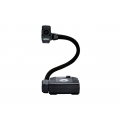

We have launched a [shop](http://shop.primaryt.co.uk/)!   I say we, I have had nothing to do with it personally but it looks great and it's obvious the guys at [Primary Technology](http://primaryt.co.uk) have been working hard! It has a few items in now and is due a proper launch in 2011 but I wanted to give readers of my blog a sneak preview =)

You can some of your Primary School ICT bits including laptop cabs, netbooks, usb keys etc.

The idea behind the shop is that it keeps the purchasing process simple.  The shop only stocks useful items and we can allow purchashing with [purchase orders](http://en.wikipedia.org/wiki/Purchase_order "Purchase order").

I'm not a big fan of a company that box shifts but it turns out that our purchasing power shouldn't be ignored as we may be able to save schools muchos dineros when purchasing equipment!  Try us out!  If we suck, let me know!

###### Related articles

- [UK schools to maintain ICT spending](http://go.theregister.com/feed/www.channelregister.co.uk/2010/09/22/school_ict_spending/) (go.theregister.com)
- [Schools expected to continue investing in IT](http://www.computing.co.uk/computing/news/2270153/schools-expected-continue) (computing.co.uk)
- [Schools will still spend on tech next year](http://www.channelweb.co.uk/crn/news/2270133/schools-spend-tech) (channelweb.co.uk)

